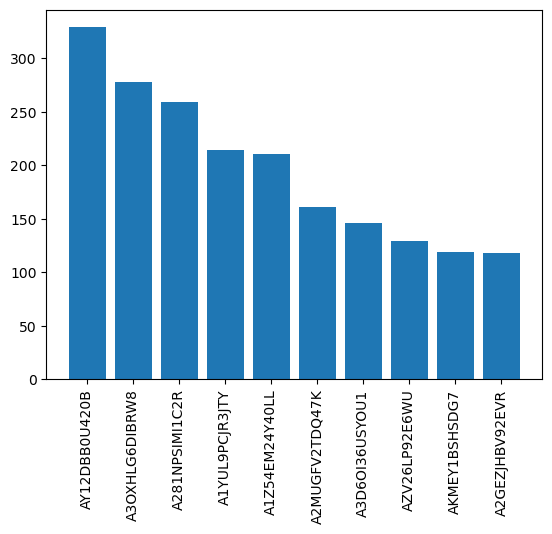
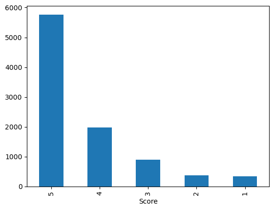
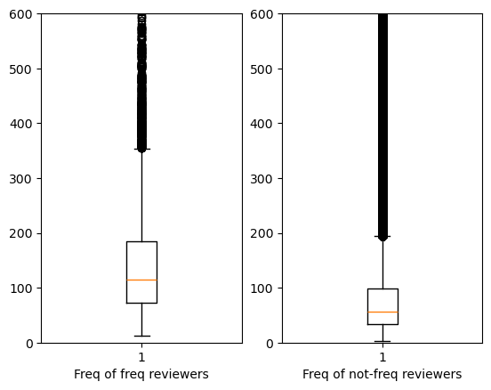
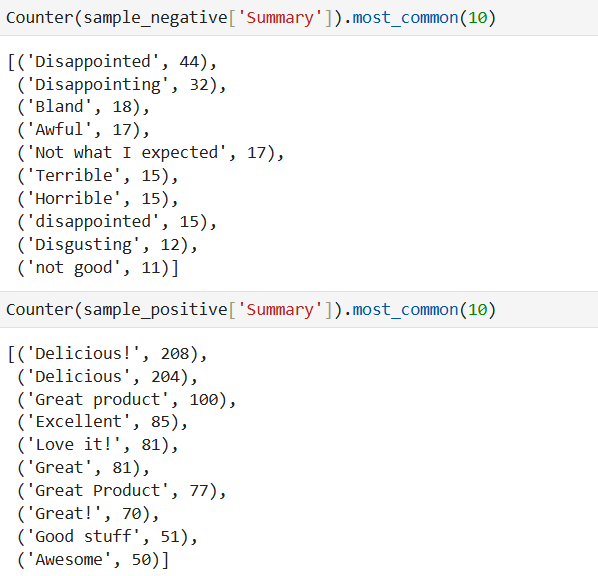

# 📦 Amazon Customers Data Analysis with Pandas

This project explores an Amazon dataset using **Python** and **Pandas** to derive actionable insights about users and products. Through exploratory data analysis and sentiment analysis, we aim to understand customer behavior and review patterns more clearly.

---

## 🔧 Technologies Used

- Python
- Pandas
- Matplotlib / Seaborn
- TextBlob or VADER (for Sentiment Analysis)
- Jupyter Notebook

---

## 📁 Dataset

- Amazon product review dataset (CSV/JSON)
- Contains columns like: `user_id`, `product_id`, `review_text`, `rating`, `review_time`, `reviewer_name`, etc.

---

## ❓ Questions & Analysis

---

### 1. 🧑‍💻 To which users can Amazon recommend more products?

We identified users with a high engagement level (based on review frequency and ratings), who are likely to be receptive to new product recommendations.

---

### 2. 📦 Which product has a good number of reviews?

We analyzed the review count per product to highlight the most-reviewed items.

---

### 3. 🔁 Is there a difference between the behavior of frequent viewers and not frequent viewers?

By classifying users based on activity, we compared engagement metrics such as average rating, time between reviews, and word count.

---

### 4. ✍️ Are frequent users more verbose?

We measured the average number of words per review across different user frequency levels.

---

### 5. 😊 Sentiment Analysis

Using a sentiment analysis model (TextBlob or VADER), we evaluated the emotional tone of user reviews. This helped identify:
- General sentiment trend (positive vs negative)
- Sentiment differences between frequent and non-frequent users

---

## 📌 Insights & Conclusion

- **Engaged users** are a great target for personalized recommendations.
- **Top-reviewed products** often correlate with higher visibility and popularity.
- **Frequent users** tend to write longer and more detailed reviews.
- Sentiment analysis reveals a mostly **positive tone**, with occasional spikes in negative feedback.

---

## 📂 Project Structure

