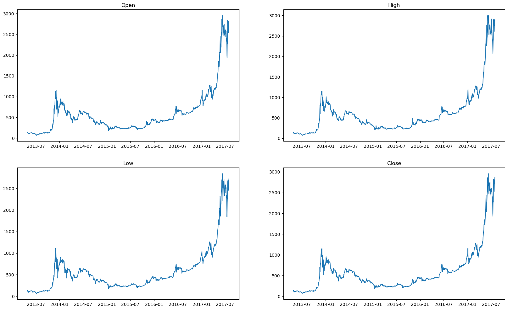
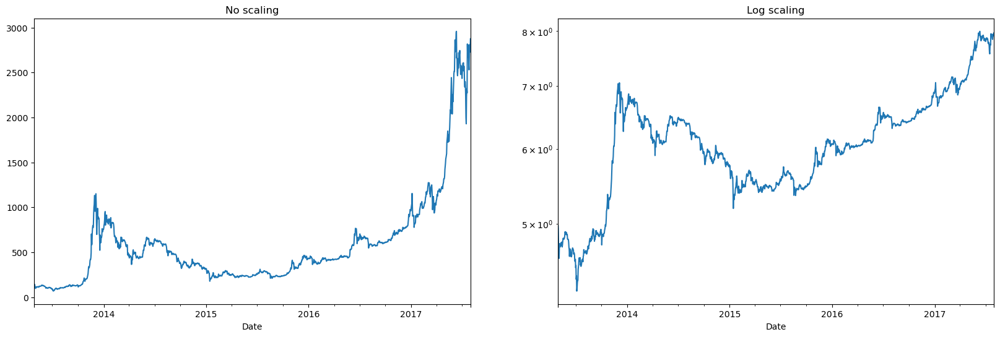

# 📈 Bitcoin Price Analysis Using Python & Plotly

This project performs a time-series analysis on historical Bitcoin price data using Python. It explores the behavior of Bitcoin’s `Open`, `High`, `Low`, and `Close` values over time and uses interactive visualizations to better understand market trends from April 2013 to July 2017.

---

## 🧠 Objectives

- Preprocess and clean raw time-series Bitcoin data.
- Analyze long-term trends using line charts, log-scaled plots, and candlestick charts.
- Explore seasonality and volatility in the crypto market.
- Calculate daily price percentage changes.
- Use resampling to analyze yearly, quarterly, and monthly price trends.
- Use `Plotly` and `Cufflinks` for interactive, browser-ready dashboards.

---

## 📦 Technologies Used

| Tool/Library       | Purpose                                      |
|--------------------|----------------------------------------------|
| `pandas`           | Data manipulation and preprocessing          |
| `numpy`            | Numerical computations                       |
| `matplotlib`       | Static data visualization                    |
| `seaborn`          | Statistical visualizations                   |
| `plotly`           | Interactive charts (e.g., candlestick, line) |
| `cufflinks`        | Linking Plotly with Pandas                   |
| `chart_studio`     | Advanced web-hosted charting (optional)      |

---

## 🔍 Key Features & Insights

- ✅ Converted raw `Date` strings into `datetime64[ns]` for accurate time-series analysis.
- ✅ Created OHLC candlestick charts using Plotly for detailed visual market analysis.
- ✅ Compared raw and log-scaled `Close` price trends to reveal exponential growth.
- ✅ Resampled data to observe price behavior on **monthly**, **quarterly**, and **yearly** bases.
- ✅ Calculated and plotted **daily percentage change** in closing price to study volatility.

---

## 📊 Sample Visuals

### 📅 Monthly Bitcoin Pickup Trend  


### 🕒 Analysing closing price (on normal scale & log-scale)  



### 📉 Analysing Daily change in Closing price of stocks


---


## ▶️ How to Run


```bash
1. Clone this repo
2. Open the `.ipynb` file in Jupyter Notebook / Google Colab
3. Make sure you install all dependencies:
   pip install pandas numpy matplotlib seaborn plotly cufflinks chart_studio
4. Run the cells and interact with the charts.
```
