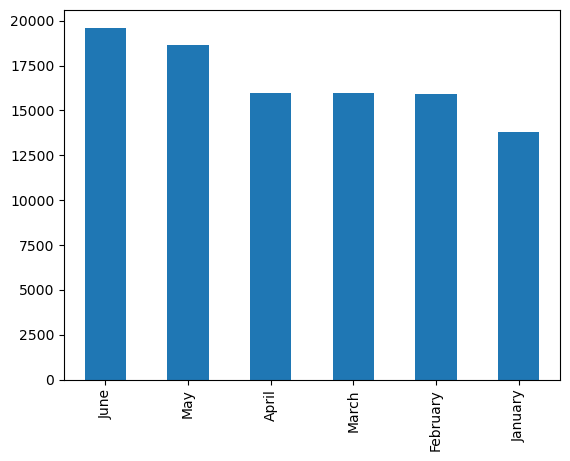
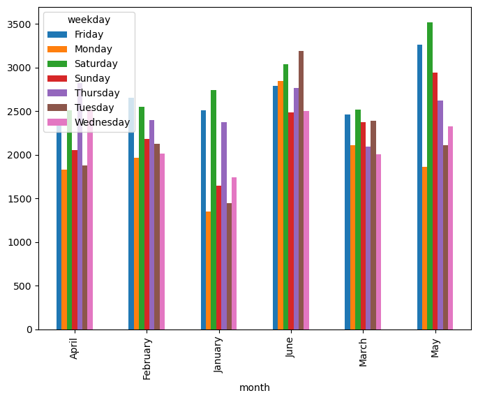
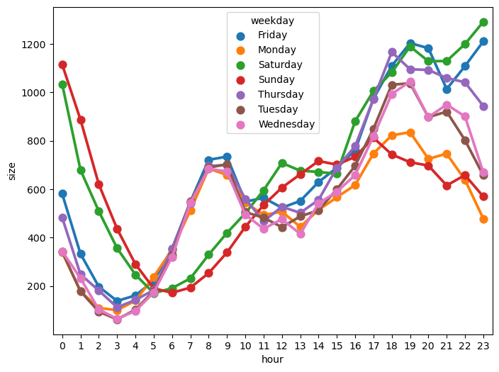
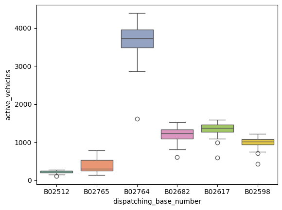
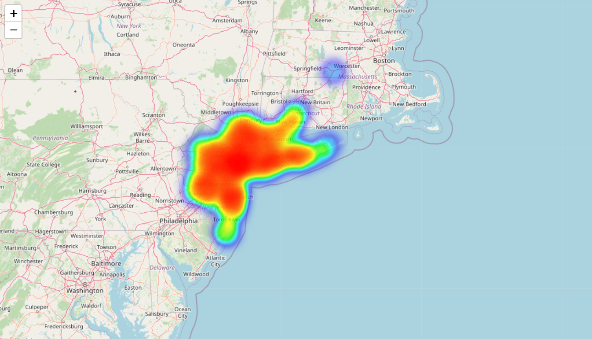

# 🚕 Uber Ride Data Analysis – NYC

This project analyzes Uber pickup data in **New York City** using **Python**, **Pandas**, and **Folium**.  
We explore temporal and spatial patterns in ride demand and visualize them with heatmaps and interactive charts.

---

## 📷 Project Screenshots

Here are some snapshots from the notebook and visualizations:

### 1. Monthly Pickup Volume  
**Which month had the maximum Uber pickups in NYC?**   

### 2. Weekday Patterns – Fun Days in NYC  
**Friday and Saturday show the highest activity — possibly due to shopping, nightlife, and weekend plans.**   

### 3. Hourly Rush Trends  
**Hourly rush analysis reveals consistent late-night demand on weekends and interesting early weekend trends on Thursdays.**  

### 4. Fleet Distribution – Base Numbers  
**Which `Base_number` has the most active vehicles? Fleet-wise distribution uncovered.**  

### 5. NYC HeatMap – High-Rush Locations
**Where in NYC do Uber pickups cluster the most?**
**Interactive heatmap created with Folium shows pickup hotspots across New York City.**

---

## 📁 Dataset

- Raw Uber pickup data from NYC  
- Includes timestamps and GPS coordinates  
- Cleaned and transformed for time-series and spatial analysis

---

## 🧹 Data Preprocessing Steps

- Data type conversion and timestamp parsing  
- Null & duplicate removal  
- New columns: Hour, Weekday, Month  
- Latitude & Longitude parsing for mapping

---

## 🧠 What Did We Discover?

- **Friday & Saturday nights** show the highest demand  
- **Sunday evenings** drop sharply in comparison  
- **Thursday nights** have almost Friday-like activity – NYC starts the weekend early  
- **Folium HeatMap** shows pickup hotspots across the city at different hours

---

## 🗺️ Mapping with Folium

We used **Folium** and **HeatMap** plugin to:

- Create interactive NYC pickup maps  
- Analyze temporal density  
- Identify rush hours & urban mobility zones

---

## 🛠 Tools Used

- Python  
- Pandas  
- Folium  
- Jupyter Notebook  
- Matplotlib & Seaborn

---

## 📄 Conclusion

This project shows how simple tools like **Pandas** and **Folium** can reveal deep insights into urban movement using real data. Great practice for data cleaning, feature extraction, time-series exploration, and spatial visualization.

## ⭐ Like what you see?

Feel free to ⭐ the repo, share your feedback, or fork it to try it with your own data!

#Uber #DataAnalysis #Python #Pandas #Folium #Geospatial #Heatmap #NYC #JupyterNotebook #ETL
